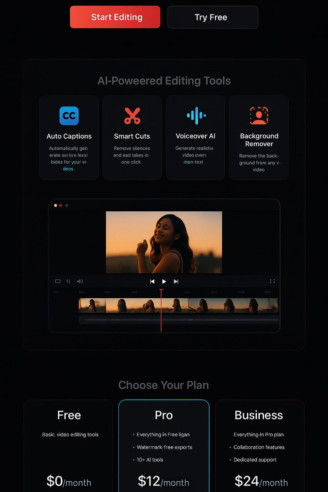
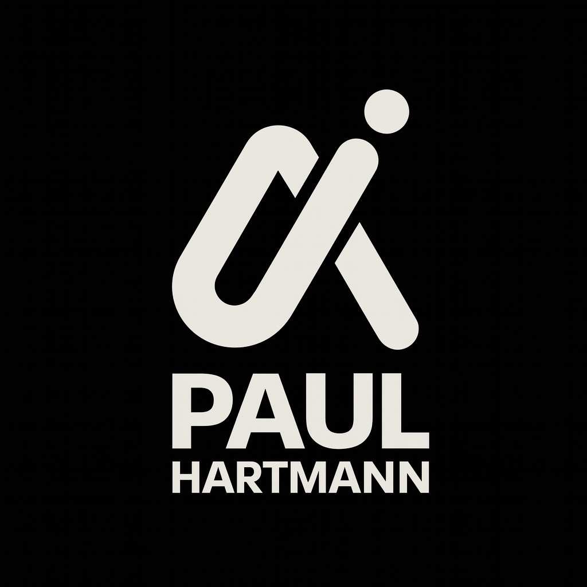

# SEO & Analytics Implementation Guide for jphart.dev

Complete implementation plan for driving traffic and measuring growth.

---

## 📊 CURRENT STATUS

### ✅ Already Implemented

**On-Page SEO:**
- ✅ Semantic HTML5 structure
- ✅ Proper heading hierarchy (H1, H2, H3)
- ✅ Mobile-responsive design
- ✅ Fast loading (minimal dependencies)
- ✅ Clean URLs
- ✅ Internal linking structure
- ✅ Meta description and title tags
- ✅ Open Graph tags for social sharing
- ✅ Favicon

**Technical SEO:**
- ✅ Sitemap.xml created
- ✅ Robots.txt created
- ✅ HTTPS enabled (via GitHub Pages)
- ✅ Mobile-first design
- ✅ Responsive images

**Performance:**
- ✅ Minimal JavaScript
- ✅ Optimized CSS
- ✅ Font optimization (Inter with display=swap)
- ✅ No render-blocking resources

---

## 🚀 IMPLEMENTATION PLAN

### Phase 1: Schema Markup & Enhanced SEO (30 minutes)

**What:** Add structured data for better search engine understanding

**Files to Update:**
1. `index.html` - Add JSON-LD schema markup

**Implementation:**
```html
<!-- Add before </head> in index.html -->
<script type="application/ld+json">
{
  "@context": "https://schema.org",
  "@type": "Person",
  "name": "Paul Hartmann",
  "alternateName": "JP Hart",
  "url": "https://jphart.dev",
  "image": "https://jphart.dev/images/paul-portrait.jpeg",
  "jobTitle": "Full-Stack Software Developer",
  "worksFor": {
    "@type": "Organization",
    "name": "jphart.dev"
  },
  "description": "Full-stack software developer specializing in web applications, mobile apps, SaaS platforms, and scalable backend systems.",
  "address": {
    "@type": "PostalAddress",
    "addressCountry": "NL"
  },
  "sameAs": [
    "https://github.com/janpaul80",
    "https://linkedin.com/in/yourprofile"
  ],
  "knowsAbout": [
    "Web Development",
    "Mobile App Development",
    "React",
    "Next.js",
    "Node.js",
    "TypeScript",
    "Python",
    "Backend Systems",
    "Cloud Infrastructure",
    "SaaS Development"
  ]
}
</script>

<script type="application/ld+json">
{
  "@context": "https://schema.org",
  "@type": "ProfessionalService",
  "name": "JP Hart Software Studio",
  "description": "Full-stack development studio specializing in web applications, mobile apps, and scalable backend systems.",
  "url": "https://jphart.dev",
  "telephone": "+31-XXX-XXXXXX",
  "email": "jp@jphart.dev",
  "priceRange": "$$-$$$",
  "areaServed": "Worldwide",
  "serviceType": [
    "Web Application Development",
    "Mobile App Development",
    "Backend Development",
    "UI/UX Engineering",
    "Cloud Deployment",
    "SaaS Development"
  ],
  "aggregateRating": {
    "@type": "AggregateRating",
    "ratingValue": "5.0",
    "reviewCount": "4"
  }
}
</script>
```

**Benefits:**
- Rich snippets in search results
- Better understanding by search engines
- Potential for enhanced SERP features

---

### Phase 2: Google Analytics 4 Setup (15 minutes)

**What:** Track visitors, behavior, and conversions

**Steps:**

1. **Create GA4 Property:**
   - Go to https://analytics.google.com
   - Create account → Create property
   - Property name: "jphart.dev"
   - Select timezone and currency
   - Create a Web data stream
   - Get your Measurement ID (format: G-XXXXXXXXXX)

2. **Add to Website:**
```html
<!-- Add to <head> in index.html, right after meta tags -->
<!-- Google Analytics 4 -->
<script async src="https://www.googletagmanager.com/gtag/js?id=G-XXXXXXXXXX"></script>
<script>
  window.dataLayer = window.dataLayer || [];
  function gtag(){dataLayer.push(arguments);}
  gtag('js', new Date());
  gtag('config', 'G-XXXXXXXXXX', {
    'send_page_view': true,
    'anonymize_ip': true
  });
</script>
```

3. **Event Tracking (Add to script.js):**
```javascript
// Track CTA button clicks
document.querySelectorAll('.btn-primary').forEach(btn => {
    btn.addEventListener('click', (e) => {
        gtag('event', 'cta_click', {
            'event_category': 'engagement',
            'event_label': btn.textContent.trim(),
            'value': 1
        });
    });
});

// Track contact form submissions
contactForm.addEventListener('submit', () => {
    gtag('event', 'form_submission', {
        'event_category': 'conversion',
        'event_label': 'contact_form',
        'value': 10
    });
});

// Track portfolio project clicks
document.querySelectorAll('.portfolio-card').forEach(card => {
    card.addEventListener('click', () => {
        const projectName = card.querySelector('.portfolio-title').textContent;
        gtag('event', 'project_view', {
            'event_category': 'engagement',
            'event_label': projectName,
            'value': 1
        });
    });
});

// Track pricing plan clicks
document.querySelectorAll('.pricing-card .btn').forEach(btn => {
    btn.addEventListener('click', () => {
        const planName = btn.closest('.pricing-card').querySelector('.pricing-plan-name').textContent;
        gtag('event', 'pricing_click', {
            'event_category': 'conversion',
            'event_label': planName,
            'value': 5
        });
    });
});

// Track scroll depth
let scrollDepth = 0;
window.addEventListener('scroll', () => {
    const depth = Math.round((window.scrollY / (document.body.scrollHeight - window.innerHeight)) * 100);
    if (depth > scrollDepth && depth % 25 === 0) {
        scrollDepth = depth;
        gtag('event', 'scroll_depth', {
            'event_category': 'engagement',
            'event_label': `${depth}%`,
            'value': depth
        });
    }
});
```

**What You'll Track:**
- Page views
- User demographics
- Traffic sources
- Button clicks
- Form submissions
- Scroll depth
- Time on page
- Bounce rate

---

### Phase 3: Google Search Console Setup (10 minutes)

**What:** Monitor search performance and indexing

**Steps:**

1. **Verify Ownership:**
   - Go to https://search.google.com/search-console
   - Add property: `https://jphart.dev`
   - Verification method: HTML tag (easiest)
   - Copy the meta tag provided
   - Add to `<head>` in index.html:
   ```html
   <meta name="google-site-verification" content="YOUR_VERIFICATION_CODE" />
   ```
   - Deploy and click "Verify"

2. **Submit Sitemap:**
   - In Search Console → Sitemaps
   - Add: `https://jphart.dev/sitemap.xml`
   - Submit

3. **Request Indexing:**
   - URL Inspection tool
   - Enter: `https://jphart.dev`
   - Click "Request Indexing"

**What You'll Monitor:**
- Search queries driving traffic
- Click-through rates
- Average position in search results
- Indexing status
- Mobile usability issues
- Core Web Vitals

---

### Phase 4: Conversion Tracking (20 minutes)

**What:** Track specific user actions that lead to business goals

**Goals to Track:**

1. **Contact Form Submissions** (Primary Conversion)
2. **Pricing Plan Clicks** (Micro Conversion)
3. **Portfolio Project Views** (Engagement)
4. **CTA Button Clicks** (Engagement)

**Implementation in script.js:**
```javascript
// Enhanced conversion tracking
function trackConversion(conversionType, value, label) {
    // Google Analytics
    if (typeof gtag !== 'undefined') {
        gtag('event', 'conversion', {
            'event_category': conversionType,
            'event_label': label,
            'value': value
        });
    }
    
    // Console log for debugging
    console.log(`Conversion tracked: ${conversionType} - ${label}`);
}

// Contact form conversion
if (contactForm) {
    contactForm.addEventListener('submit', async (e) => {
        // ... existing code ...
        
        // Track conversion
        trackConversion('lead_generation', 100, 'contact_form_submit');
    });
}

// Pricing plan interest
document.querySelectorAll('.pricing-card .btn').forEach(btn => {
    btn.addEventListener('click', (e) => {
        const planName = btn.closest('.pricing-card').querySelector('.pricing-plan-name').textContent;
        trackConversion('pricing_interest', 50, planName);
    });
});
```

---

### Phase 5: Page Speed Optimization (30 minutes)

**What:** Improve Core Web Vitals for better SEO

**Current Optimizations Needed:**

1. **Image Optimization:**
```html
<!-- Add to portfolio images -->

```

2. **Font Loading Optimization:**
```html
<!-- Already implemented, but verify -->
<link rel="preconnect" href="https://fonts.googleapis.com">
<link rel="preconnect" href="https://fonts.gstatic.com" crossorigin>
<link href="https://fonts.googleapis.com/css2?family=Inter:wght@300;400;500;600;700;800;900&display=swap" rel="stylesheet">
```

3. **Resource Hints:**
```html
<!-- Add to <head> -->
<link rel="dns-prefetch" href="https://www.google-analytics.com">
<link rel="preload" href="styles.css" as="style">
<link rel="preload" href="script.js" as="script">
```

**Test Performance:**
- Google PageSpeed Insights: https://pagespeed.web.dev/
- GTmetrix: https://gtmetrix.com/
- WebPageTest: https://www.webpagetest.org/

**Target Scores:**
- Performance: 90+
- Accessibility: 95+
- Best Practices: 95+
- SEO: 100

---

### Phase 6: Alt Text & Accessibility (15 minutes)

**What:** Add descriptive alt text to all images

**Implementation:**
```html
<!-- Portfolio images -->




<!-- Logo -->


<!-- Portrait -->

```

---

## 📈 ANALYTICS DASHBOARD SETUP

### Key Metrics to Monitor:

**Traffic Metrics:**
- Total visitors (daily/weekly/monthly)
- New vs returning visitors
- Traffic sources (organic, direct, referral, social)
- Geographic location
- Device breakdown (desktop/mobile/tablet)

**Engagement Metrics:**
- Average session duration
- Pages per session
- Bounce rate
- Scroll depth
- Time on page

**Conversion Metrics:**
- Contact form submissions
- Pricing plan clicks
- Portfolio project views
- CTA button clicks
- Email link clicks

**SEO Metrics (Search Console):**
- Total impressions
- Total clicks
- Average CTR
- Average position
- Top performing queries
- Top performing pages

---

## 🎯 RECOMMENDED TOOLS

### Free Tools:

1. **Google Analytics 4** (Traffic & Behavior)
   - Free, comprehensive
   - Real-time data
   - Custom events

2. **Google Search Console** (SEO Performance)
   - Free, essential
   - Search query data
   - Indexing status

3. **Microsoft Clarity** (Heatmaps & Session Recordings)
   - Free, unlimited
   - Visual behavior tracking
   - No impact on performance
   - Setup: https://clarity.microsoft.com/

4. **Plausible** (Privacy-Friendly Alternative)
   - Paid ($9/month)
   - GDPR compliant
   - Lightweight script
   - Simple dashboard

### Setup Microsoft Clarity (Optional but Recommended):

```html
<!-- Add before </head> -->
<script type="text/javascript">
    (function(c,l,a,r,i,t,y){
        c[a]=c[a]||function(){(c[a].q=c[a].q||[]).push(arguments)};
        t=l.createElement(r);t.async=1;t.src="https://www.clarity.ms/tag/"+i;
        y=l.getElementsByTagName(r)[0];y.parentNode.insertBefore(t,y);
    })(window, document, "clarity", "script", "YOUR_PROJECT_ID");
</script>
```

**Benefits:**
- See exactly how users interact with your site
- Identify UX issues
- Understand user behavior patterns
- Free heatmaps and session recordings

---

## 🚀 QUICK START CHECKLIST

### Week 1: Foundation
- [ ] Add schema markup to index.html
- [ ] Set up Google Analytics 4
- [ ] Set up Google Search Console
- [ ] Submit sitemap
- [ ] Request indexing
- [ ] Add conversion tracking

### Week 2: Optimization
- [ ] Optimize all images (alt text, lazy loading)
- [ ] Test page speed (aim for 90+ score)
- [ ] Set up Microsoft Clarity (optional)
- [ ] Add resource hints
- [ ] Test mobile performance

### Week 3: Monitoring
- [ ] Check GA4 data (traffic sources, behavior)
- [ ] Review Search Console (queries, CTR)
- [ ] Analyze conversion funnel
- [ ] Identify top-performing content
- [ ] Make data-driven improvements

---

## 📊 EXPECTED TIMELINE & RESULTS

### Month 1:
- **Setup Complete:** All tracking in place
- **Initial Data:** Baseline metrics established
- **Indexing:** Site fully indexed by Google
- **Traffic:** 50-100 visitors/month (organic)

### Month 2-3:
- **SEO Momentum:** Rankings improve for target keywords
- **Traffic Growth:** 200-500 visitors/month
- **Conversions:** 5-10 contact form submissions
- **Insights:** Clear understanding of user behavior

### Month 4-6:
- **Established Presence:** Ranking for multiple keywords
- **Traffic:** 500-1000+ visitors/month
- **Conversions:** 15-30 leads/month
- **Optimization:** Data-driven improvements showing results

---

## 🎯 KEY PERFORMANCE INDICATORS (KPIs)

### Primary KPIs:
1. **Organic Traffic Growth:** +20% month-over-month
2. **Contact Form Submissions:** 10+ per month
3. **Average Session Duration:** 2+ minutes
4. **Bounce Rate:** <60%

### Secondary KPIs:
1. **Search Console CTR:** >3%
2. **Average Position:** Top 10 for target keywords
3. **Page Speed Score:** 90+
4. **Mobile Traffic:** 40%+ of total

---

## 🔧 MAINTENANCE SCHEDULE

### Daily:
- Monitor GA4 real-time for any issues

### Weekly:
- Check GA4 dashboard (traffic, conversions)
- Review Search Console (new queries, errors)
- Monitor page speed

### Monthly:
- Comprehensive analytics review
- Update content based on data
- Check for broken links
- Review and optimize underperforming pages
- Update sitemap if needed

### Quarterly:
- Full SEO audit
- Competitor analysis
- Strategy adjustment
- Content refresh

---

## 📞 NEXT STEPS

1. **Immediate:** I'll add schema markup and prepare analytics code
2. **Your Action:** Create Google Analytics 4 account and get Measurement ID
3. **Your Action:** Set up Google Search Console
4. **Together:** Implement tracking and monitor results

**Ready to implement? Let me know and I'll add all the SEO enhancements and analytics code to your site!**
